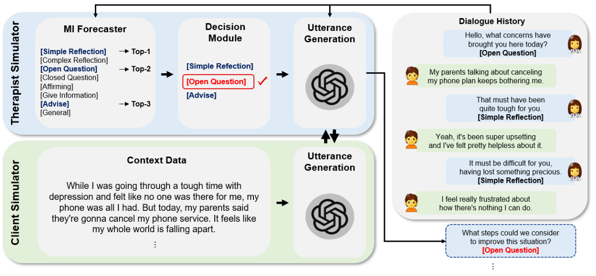
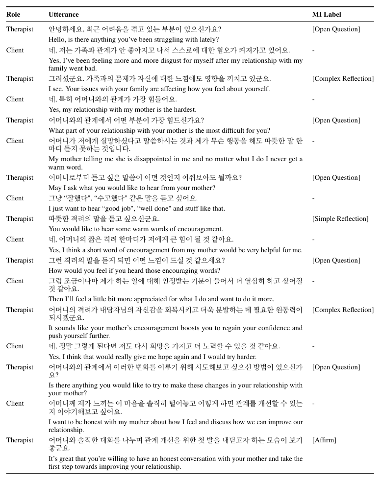

# 👩🏻‍⚕️ KMI: A Dataset of Korean Motivational Interviewing Dialogues for Psychotherapy
This repository contains KMI, the first synthetic dataset theoretically grounded in Motivational Interviewing (MI). KMI consists of 1,000 high-quality Korean MI dialogues encompassing 7 categories. We generated KMI using a novel LLM-based framework that simulates MI sessions enriched with the expertise of professional therapists. Each therapist utterance is annotated with one of the MI labels listed below. Although our dataset was originally designed for Korean, we also provide English translations of the dialogues for broader use. For more details, please refer to our [paper](https://aclanthology.org/2025.naacl-long.541/). We hope our work helps alleviate the shortage of publicly available data for psychotherapy, particularly in non-English languages!

<br />

<p align="center">
  
</p>

## Categories
- `Mental Health`
- `Interpersonal Relationships`
- `Ego·Personality`
- `Career·Employment`
- `Academic·Examination`
- `Addiction·Obsession`
- `Family`

## MI Labels
- `Simple Reflection`
- `Complex Reflection`
- `Open Question`
- `Closed Question`
- `Affirm`
- `Give Information`
- `Advise`
- `General`

## Example
<p align="center">
  
</p>

## Citation
If you find our dataset useful, please cite our work:
```
@article{kim2025kmi,
  title={KMI: A Dataset of Korean Motivational Interviewing Dialogues for Psychotherapy},
  author={Kim, Hyunjong and Lee, Suyeon and Cho, Yeongjae and Ryu, Eunseo and Jo, Yohan and Seong, Suran and Cho, Sungzoon},
  journal={arXiv preprint arXiv:2502.05651},
  year={2025}
}
```
